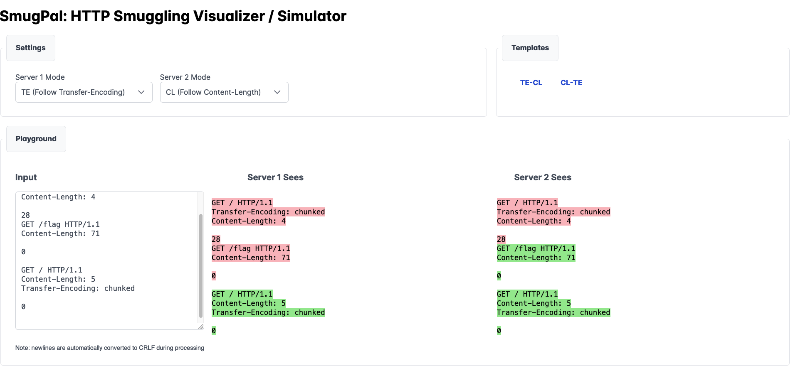

# SmugPal

[HTTP Smuggling](https://portswigger.net/web-security/request-smuggling) simulator / visualizer and command line generator.

Workbench for developing HTTP Smuggling / Desync exploits interactively and visually.

